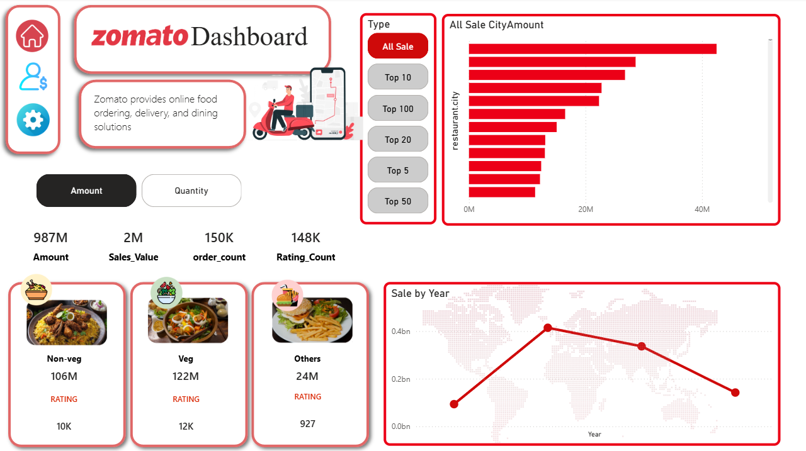

# 🍴 Zomato Power BI Dashboard

## 📌 Project Overview

This project is a **Power BI dashboard** built using Zomato dataset to analyze food ordering, sales performance, ratings, and customer preferences.
The dashboard provides interactive insights into:

* Overall sales and revenue trends
* Food category performance (Veg, Non-Veg, Others)
* Customer order patterns & ratings
* City-wise sales comparison
* Yearly sales growth/decline

The goal of this dashboard is to help stakeholders understand business performance, identify top-performing regions, and track customer preferences for better decision-making.

---

## 📊 Dashboard Features

✅ **KPIs Section**:

* Total Revenue (₹987M)
* Sales Value (2M)
* Order Count (150K)
* Rating Count (148K)

✅ **Food Category Analysis**:

* Non-Veg, Veg, and Others with revenue & ratings

✅ **Sales by City**:

* Interactive bar chart showing city-wise sales
* Filters available for Top 5, Top 10, Top 20, Top 50

✅ **Sales Trend by Year**:

* Line chart to track yearly growth and decline

✅ **Interactive Controls**:

* Switch between **Amount** and **Quantity**
* Filters for city-level analysis

---

## 🛠️ Tools & Technologies

* **Power BI** – Data visualization & dashboard creation
* **Excel / CSV Dataset** – Data source (Zomato food order data)
* **Data Cleaning** – Handled within Power Query

---

## 📷 Dashboard Preview




---

## 🚀 How to Use

1. Clone this repository

   ```bash
   git clone https://github.com/yourusername/zomato-dashboard.git
   ```
2. Open the `.pbix` file in **Power BI Desktop**
3. Explore the dashboard using slicers and filters

---

## 📈 Insights Gained

* Veg category has the highest sales (₹122M), followed by Non-Veg (₹106M)
* City-level sales distribution shows strong regional variation
* Ratings and order counts provide insights into customer engagement
* Yearly sales trends highlight both growth and decline phases

---

## 🔮 Future Improvements

* Add **customer demographics** analysis
* Integrate **real-time API data**
* Include **delivery time & cost analysis**
* Build **predictive models** for future sales

---

## 🙌 Acknowledgements

This project was created for **data visualization practice** using Zomato dataset and Power BI.
